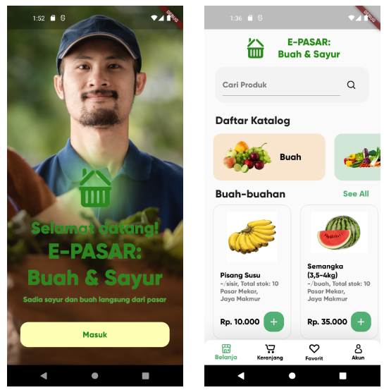
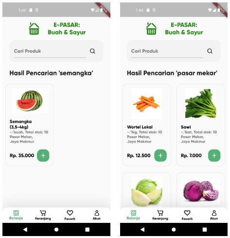
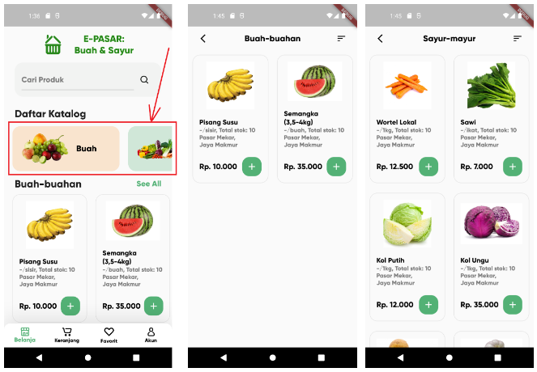
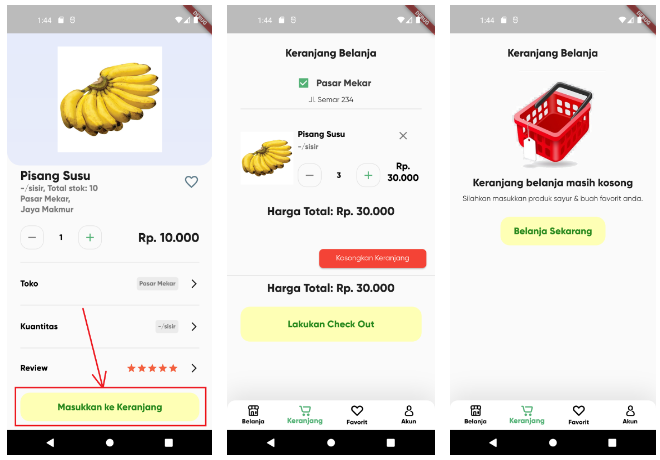
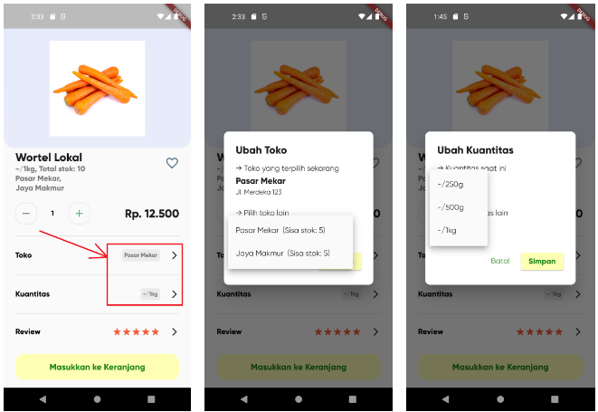
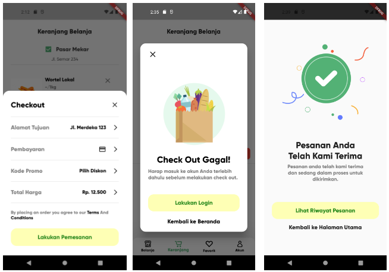
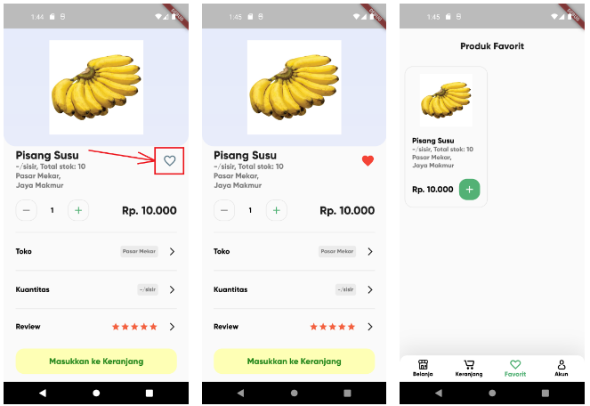
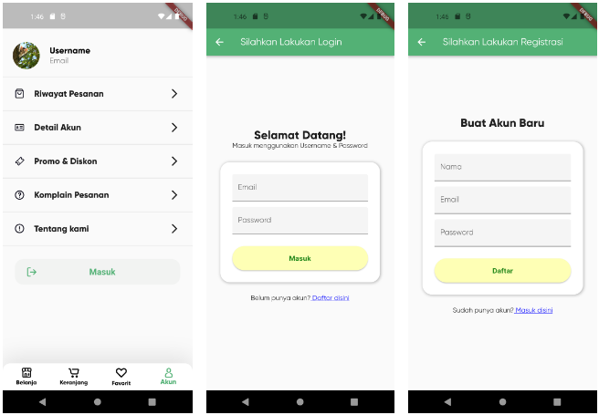

E-PASAR: Buah & Sayur
-------------

### Untuk mencoba prototype aplikasi yang sudah jadi, dapat mendownload apk pada [Tab Perilisan](https://github.com/albert1911/ambw_flutter/tree/main/apk/release)
#### Sebelum menginstal APK pastikan pilih versi APK yang sesuai dengan arsitektur ponsel anda.

-------------

## Screenshots  

  
   
  
  
   
  
  
  

-------------

## Fitur  
- Filter Produk, filter membedakan antara produk sayur dan buah.
- Pencarian Produk, dapat melakukan pencarian terhadap nama produk maupun nama toko/pasar yang menjual produk tersebut.
- Keranjang Belanja, menambahkan berbagai macam produk sebelum melakukan checkout.
- Simulasi Checkout, melakukan simulasi pembayaran yang nantinya akan tercatat ke dalam server database dan ditampilkan di aplikasi pada bagian "Riwayat Pemesanan".
- Produk Favorit, dapat menambahkan produk tertentu ke dalam "Favorit" agar lebih mudah ditemukan nantinya.

-------------

## Server & Database
Struktur database yang digunakan pada aplikasi ini dapat dilihat pada [Tab Database](https://github.com/albert1911/ambw_flutter/tree/main/database_structure)

-------------

#### Template Awal : [Flutter Grocery App UI](https://github.com/mohammedhashim44/Flutter-Grocery-App-UI#readme)
